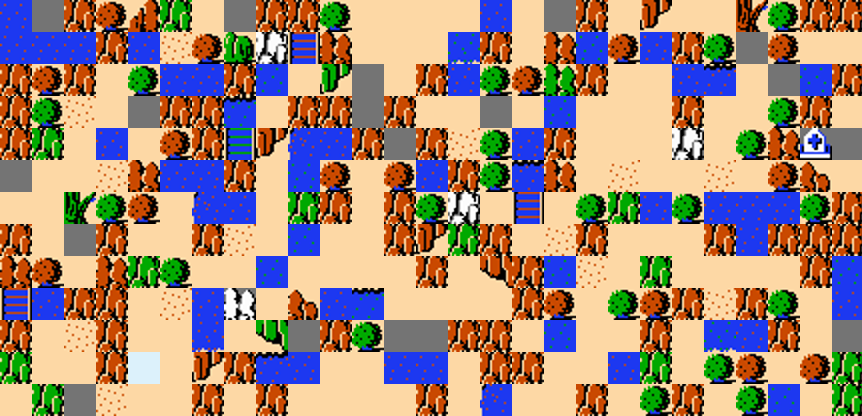

#Overworld Forever

I have been playing around with a new approach to [Procedural Content Generation](http://en.wikipedia.org/wiki/Procedural_generation) for games. It uses existing game content to train the transition probabilities of [Markov-Chains](http://en.wikipedia.org/wiki/Markov_chain).  The chains can then be used to generate many variations on the original content.  This approach has been pioneered by Sam Snodgrass and Santiago Ontañón from Drexel University, most recently in their paper [Experiments in Map Generation using Markov Chains](http://www.fdg2014.org/papers/fdg2014_paper_29.pdf).  In the paper, they applid the approach to generating Super Mario levels.

I've been trying out some loosely similar techniques on the overworld map from the original [Legend of Zelda](http://en.wikipedia.org/wiki/The_Legend_of_Zelda_(video_game)).  The approach is easy to implement on descreate ordered data such as strings or tile maps and has yielded some fun results.  I've uploaded a [demo in written Processing to Github](https://github.com/davemor/overworld-forever).

The data for the Zelda overworld map was found on [Al Sweigart's GitHub account](https://github.com/asweigart/nes_zelda_map_data).  Al had done the hard work of extracting the data out of the NES rom file for his [Zelda Walking Tour project](http://inventwithpython.com/blog/2012/12/10/8-bit-nes-legend-of-zelda-map-data/).  Using the data, I tried two approaches to generating maps.

I wrote the project up for [Seeds: The PROCJAM Zine](http://www.procjam.com/seeds/) and was lucky enough to have it included in the first issue.  Check it out for a bit more discussion about the project.